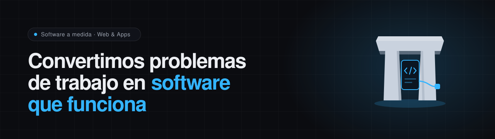

  <picture>
    <source media="(prefers-color-scheme: dark)" srcset="assets/banner-dark.svg">
    <source media="(prefers-color-scheme: light)" srcset="assets/banner-light.svg">
    
  </picture>

  
  
  
  

 

Diseñamos, desarrollamos y mantenemos **webs y aplicaciones a medida** que eliminan
tareas manuales, ahorran horas y hacen crecer tu negocio. Tú explicas el problema;
nosotros lo resolvemos.

No vendemos plantillas: partimos de cómo trabajas hoy y construimos exactamente lo
que necesitas.

 

| ⏱ Respuesta | 📦 Código | 🤝 Trato | ♾ Soporte |
| :--: | :--: | :--: | :--: |
| **24–48 h** | **100 % tuyo** | **1:1, sin intermediarios** | **Continuo** |

 

## Qué hacemos

<table>
<tr>
<td width="33%" valign="top">

**Desarrollo web a medida**

Webs corporativas, landings y plataformas rápidas, seguras y fáciles de gestionar.

</td>
<td width="33%" valign="top">

**Aplicaciones a medida**

Apps web y móviles que digitalizan y automatizan tus procesos internos.

</td>
<td width="33%" valign="top">

**Automatización de procesos**

Conectamos tus herramientas y eliminamos el trabajo repetitivo que roba horas.

</td>
</tr>
<tr>
<td width="33%" valign="top">

**Mantenimiento y soporte**

Actualizaciones, seguridad, copias y mejoras continuas. Nunca te quedas solo.

</td>
<td width="33%" valign="top">

**E-commerce y reservas**

Tiendas online y sistemas de citas y pagos listos para vender.

</td>
<td width="33%" valign="top">

**Consultoría de producto**

Te ayudamos a decidir qué construir, en qué orden y con qué tecnología.

</td>
</tr>
</table>

<a href="https://talaiot-systems.netlify.app/es/servicios/">Ver todos los servicios →</a>

 

## Cómo trabajamos

Un proceso claro, sin cajas negras. Sabrás en todo momento qué estamos haciendo,
por qué y en qué punto está tu proyecto.

| | | |
| :--: | --- | --- |
| **01** | **Escuchamos** | Entendemos el problema real y tu forma de trabajar antes de escribir una sola línea de código. |
| **02** | **Diseñamos** | Definimos la solución, el alcance y un presupuesto claro. Sin letra pequeña ni sorpresas. |
| **03** | **Construimos** | Desarrollo iterativo con entregas frecuentes: ves avances reales desde el primer día. |
| **04** | **Mantenemos** | Lanzamos, medimos y mejoramos. Cuidamos tu solución mientras tu negocio crece. |

 

## Proyectos

Problemas reales, resueltos con software.

| Sector | Proyecto | Resultado |
| --- | --- | --- |
| Logística | **Panel de operaciones a medida** — sustituimos una maraña de hojas de cálculo por una aplicación central. | **−70 %** tiempo administrativo |
| Servicios profesionales | **Portal de clientes y reservas** — web con sistema de citas y pagos integrado y automático. | **×3** reservas online |
| Retail | **E-commerce headless** — tienda rápida y escalable conectada a su sistema de gestión. | **+45 %** conversión |

<a href="https://talaiot-systems.netlify.app/es/proyectos/">Ver proyectos →</a>

 

## Stack

Tecnología moderna, mantenimiento incluido y código siempre tuyo.

  
  
  
  
  
  
  
  
  
  

 

---

   
  <strong>¿Tienes un problema que el software podría resolver?</strong>
   
  Cuéntanoslo. La primera conversación es gratis y sin compromiso.
    
  
  &nbsp;
  
    
  
    <a href="https://talaiot-systems.netlify.app/es/">talaiot-systems.netlify.app</a> ·
    <a href="mailto:lluissoberats@gmail.com">lluissoberats@gmail.com</a> ·
    <a href="tel:+34691304329">+34 691 304 329</a>
  
    

